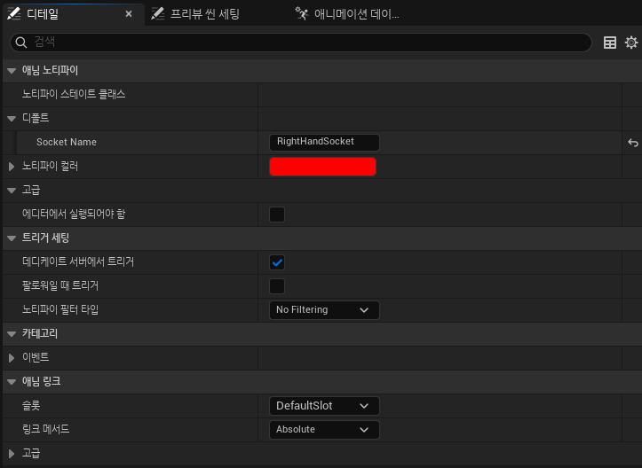

# Attack Trace

## 개요
공격 애니메이션을 재생하는 중에 무기 궤적에 따라 충돌 검사를 수행합니다.
- [실행 결과](https://drive.google.com/file/d/1K2FO4v9OAhV7bVxUhcMZzo9494uVe31n/view?usp=sharing)

## 구현 내용
### Anim Notify State
- 애님 노티파이 스테이트를 사용하여 애니메이션이 재생될 동안 트레이스를 수행할 구간을 설정합니다.
- 소켓을 입력하여 특정 무기만 선택하여 트레이스를 수행합니다.


### 여러 충돌 모양 지원
- Box, Capsule 형태로 트레이스를 수행할 수 있습니다. 무기 액터가 가지고 있는 히트박스 컴포넌트와 일치하는 모양을 선택한 다음 트레이스를 수행합니다.
```cpp
struct FEmptyAttackTrace { };
struct FBoxAttackTrace { };
struct FCapsuleAttackTrace { };

using FAttackTraceShape =
	TVariant<FEmptyAttackTrace, FBoxAttackTrace, FCapsuleAttackTrace>;
```
- [AttackTraceShapes](../../DungeonRealms/CombatSystem/DungeonRealmsAttackTraceShapes.h#L5-L10)

```cpp
// 프리미티브 컴포넌트와 트레이스 모양을 등록합니다.
AttackTraceShapes.Add(UBoxComponent::StaticClass(),
	CreateAttackTraceShape<FBoxAttackTrace>());
AttackTraceShapes.Add(UCapsuleComponent::StaticClass(),
	CreateAttackTraceShape<FCapsuleAttackTrace>());

...

// 히트박스 컴포넌트와 일치하는 트레이스 모양을 선택합니다.
FAttackTraceShape AttackTraceShape = AttackTraceShapes.FindRef(HitboxComponent->GetClass(), CreateAttackTraceShape<FEmptyAttackTrace>());

...

// 트레이스 실행
TArray<FHitResult> SubHits = Visit(
	FPerformAttackTrace(
		HitboxComponent.Get(),
		TraceStartTransform.GetLocation(),
		TraceEndTransform.GetLocation(),
		TraceAverageTransform.GetRotation(),
		ObjectQueryParams,
		CollisionQueryParams
	),
	AttackTraceShape
);
```
- [AttackTracer](../../DungeonRealms/CombatSystem/DungeonRealmsAttackTracer.h)

### 분할 충돌 검사
- 충돌 검사를 할 때, 무기의 이전 프레임의 트랜스폼과 현재 프레임의 트랜스폼을 일정 간격(substep)으로 보간(interpolation)한 결과로 검사를 수행합니다. 이를 통해 궤적이 복잡하더라도 최대한 근사(approximiation)하여 충돌 판정을 합니다.
```cpp
for (int32 i = 0; i < Substeps; ++i)
{
    FTransform TraceStartTransform = UKismetMathLibrary::TLerp(
        GetLastHitboxTransform(),
        HitboxComponent->GetComponentTransform(),
        static_cast<float>(i) / Substeps,
        ELerpInterpolationMode::DualQuatInterp
    );
    
    FTransform TraceEndTransform = UKismetMathLibrary::TLerp(
        GetLastHitboxTransform(),
        HitboxComponent->GetComponentTransform(),
        static_cast<float>(i + 1) / Substeps,
        ELerpInterpolationMode::DualQuatInterp
    );
    
    FTransform TraceAverageTransform = UKismetMathLibrary::TLerp(
        TraceStartTransform,
        TraceEndTransform,
        0.5f,
        ELerpInterpolationMode::DualQuatInterp
    );

    ...
}
```
- [AttackTracer](../../DungeonRealms/CombatSystem/DungeonRealmsAttackTracer.cpp#L43-L64)

## 문제 및 해결
### 다양한 트레이스 모양 지원
박스, 캡슐 등 다양한 트레이스 형태를 지원하기 위해서 `TVariant`을 사용한 Visitor 패턴을 구현하였습니다. 이 방식은 각 트레이스 형태가 자신에게 필요한 데이터만 독립적으로 보유할 수 있어 코드의 가독성과 유지보수성을 높입니다. `TVariant` 타입은 컴파일에 데이터가 결정되므로 성능도 좋고, 오류도 찾기 쉽습니다.
- [AttackTraceShapes](../../DungeonRealms/CombatSystem/DungeonRealmsAttackTraceShapes.h)

### 충돌 유효성 검사
트레이스를 통해 충돌을 판정하더라도 해당 충돌이 유효하지 않을 수 있습니다. 예를 들어, 장애물을 사이의 두고 공격을 한다면, 공격 트레이스는 벽을 통과하여 판정을 수행할 것이고 상대방은 벽 넘어로 공격을 당할 수 있습니다.

이를 해결하기 위해서 충돌 판정 이후에, 무기와 상대방 사이에 장애물이 있는지 검사합니다. 그리도 무기와 공격자 사이에도 마찬가지로 장애물이 있는지 검사합니다. 이 판정을 통과한 후에 나머지 작업을 수행합니다.

```cpp
bool UDungeonRealmsCombatStatics::HasObstacleBetween(const AActor* SourceActor, const AActor* TargetActor)
{
	FCollisionQueryParams CollisionQueryParams;
	CollisionQueryParams.AddIgnoredActor(SourceActor);
	CollisionQueryParams.AddIgnoredActor(TargetActor);
	CollisionQueryParams.bTraceComplex = false;

	FHitResult ObstacleHit;
	return SourceActor->GetWorld()->LineTraceSingleByChannel(
		ObstacleHit,
		SourceActor->GetActorLocation(),
		TargetActor->GetActorLocation(),
		DungeonRealms_TraceChannel_Obstacle,
		CollisionQueryParams
	);
}
```
- [HasObstacleBetween](../../DungeonRealms/CombatSystem/DungeonRealmsCombatStatics.cpp#L9-L24)