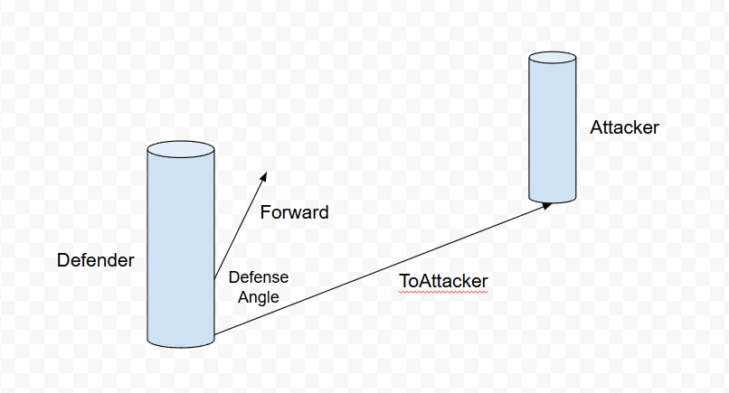
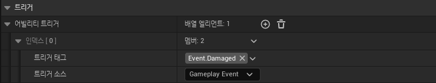
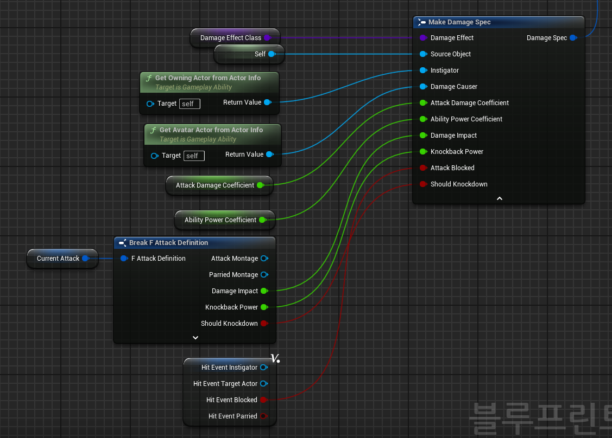
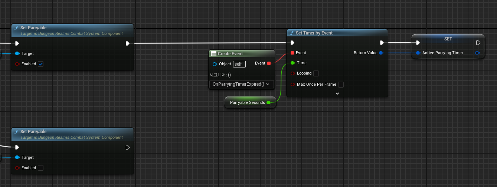
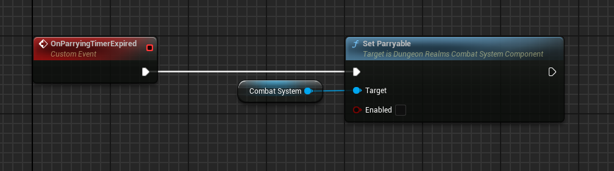
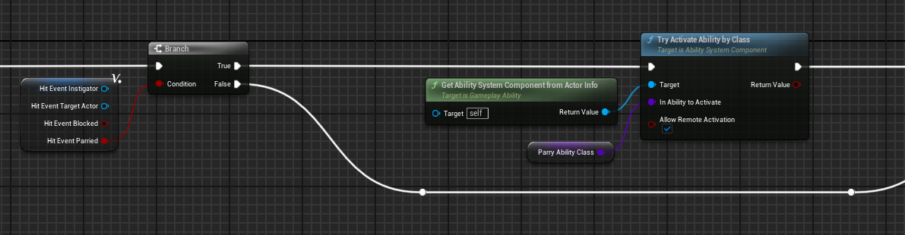
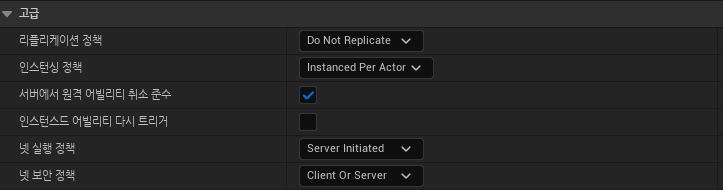

# Block And Parry

## 개요
상대방의 공격을 막거나(Block) 쳐내는(Parry) 행동을 구현합니다.
- [결과 영상](https://drive.google.com/file/d/1d6lxRtUkdmIVporOcjgEp6_RYPO8wVxg/view?usp=sharing)

## 구현 내용
### 가드 어빌리티
- 캐릭터가 가드 어빌리티를 실행하여 방어 상태로 진입합니다. 이때 `State.Guarding` 게임플레이 태그를 소유합니다. 이 태그는 가드 어빌리티가 종료될 때까지 유지됩니다.
- 가드 어빌리티가 시작되면 `CombatSystemComponent`에 방어 각도를 설정합니다. ([SetDefensibleAngle](../../DungeonRealms/CombatSystem/DungeonRealmsCombatSystemComponent.cpp#L213-L216))

### 방어 과정
- 공격자가 공격 트레이스를 통해서 충돌한 액터를 찾습니다. 그리고 충돌한 액터들 중에 현재 방어 상태인 액터를 찾습니다. ([ProcessHitEvents](../../DungeonRealms/CombatSystem/DungeonRealmsCombatSystemComponent.cpp#L96-L129))
- 방어 상태인 액터에게 해당 공격을 방어할 수 있는 지 질의합니다.
- 방어자는 공격자로부터 질의가 오면, 방어자의 전방 벡터와 방어자에서 공격자로 향하는 방향 벡터 사이의 각도를 계산하여 가드 어빌리티가 설정한 방어 각도와 비교합니다. 계산한 각도가 방어 각도보다 작거나 같으면 방어가 성공한 것이고, 그렇지 않다면 실패로 판단합니다.

- 방어가 성공하면 방어자는 델리게이트를 통해 방어가 성공했음을 알림니다([OnGuardHits](../../DungeonRealms/CombatSystem/DungeonRealmsCombatSystemComponent.cpp#L255)). 그리고 공격자에게 질의 결과를 반환합니다. 공격자는 이 결과를 가지고 나머지 공격 과정을 수행합니다.

### Block
- 상대방의 공격을 막아냈다면, 블록 어빌리티가 실행됩니다. 이 어빌리티는 게임플레이 이벤트를 통해서 발동됩니다.

- 블록 어빌리티는 상대방의 공격이 주는 데미지의 1/10만 받습니다. 따라서 상대방은 데미지 효과를 적용할 때, 공격이 막혔음을 설정합니다.

- 데미지를 계산할 때, 방어 성공 여부에 따라서 최종 데미지를 계산합니다. ([CalculateDamage](../../DungeonRealms/AbilitySystem/Executions/DungeonRealmsDamageExecution.cpp#L92))

### Parry
- 패링 어빌리티는 가드 어빌리티가 시작한 뒤, 일정 시간 이내로 공격을 막아낼 경우 발동합니다. 이를 구현하기 위해서 가드 어빌리티가 시작할 때, `CombatSystemComponent`에 패링이 가능함을 설정합니다([SetParryable](../../DungeonRealms/CombatSystem/DungeonRealmsCombatSystemComponent.h#L117)). 그리고 타이머를 설정하여 일정 시간이 지난 후에 `CombatSystemComponent`에 패링이 가능하지 않음을 설정합니다.
    - SetParryingTimer
    
    - ExpiredParryingTimer
    
- 블록 어빌리티와 다르게 패링 어빌리티는 성공하면 전혀 데미지를 입지 않습니다. 따라서 패링이 성공하면 가드 어빌리티에서 `OnGuardHits` 델리게이트를 통해 결과를 전달받고 패링 어빌리티를 실행합니다.

## 문제 및 해결
### 블록 어빌리티 리플리케이션
블록 어빌리티는 데미지 효과가 적용된 이후에 게임플레이 이벤트에 의해서 발동됩니다. 따라서 서버에서 어빌리티가 시작하는데, 어빌리티 네트워크 실행 정책이 **Local Predicted**으로 설정되어 있기 때문에 서버에서 어빌리티가 실행될 때 클라이언트로 복제되지 않습니다. 따라서 네트워크 실행 정책을 **Server Initiated**로 설정하여 클라이언트로 복제합니다.

### 모션 워핑 동기화
공격 어빌리티에는 **Knockback Power** 속성이 있습니다. 이 속성은 공격을 당한 상대방이 얼마나 밀려날지를 정의합니다. 블록 어빌리티의 경우도 이 속성을 적용합니다. 이때, 밀려나는 거리에 맞춰서 애니메이션을 재생해주는 **모션 워핑** 기능을 사용합니다. 그런데 모션 워핑은 네트워크 동기화 기능이 없습니다. 그래서 RPC를 사용하여 동기화를 하였습니다. [SyncWarpTargetFromLocation](../../DungeonRealms/Characters/DungeonRealmsCharacter.cpp#L121-L133)

### 가드, 블록, 패링 어빌리티를 각각 구현한 이유
가드, 블록 패링 어빌리티를 각각 구현한 이유는 각 어빌리티마다 책임을 명확히 분할하여 유지보수성을 향상시키기 위해서입니다. 그리고 하나의 어빌리티가 여러 상태를 갖고 있으면 복잡도가 증가하고 예외를 처리하기 어려워집니다. 이를 각 어빌리티로 분리하여 실행한다면 어빌리티 시스템의 기능을 활용하여 좀 더 쉽게 처리할 수 있습니다.