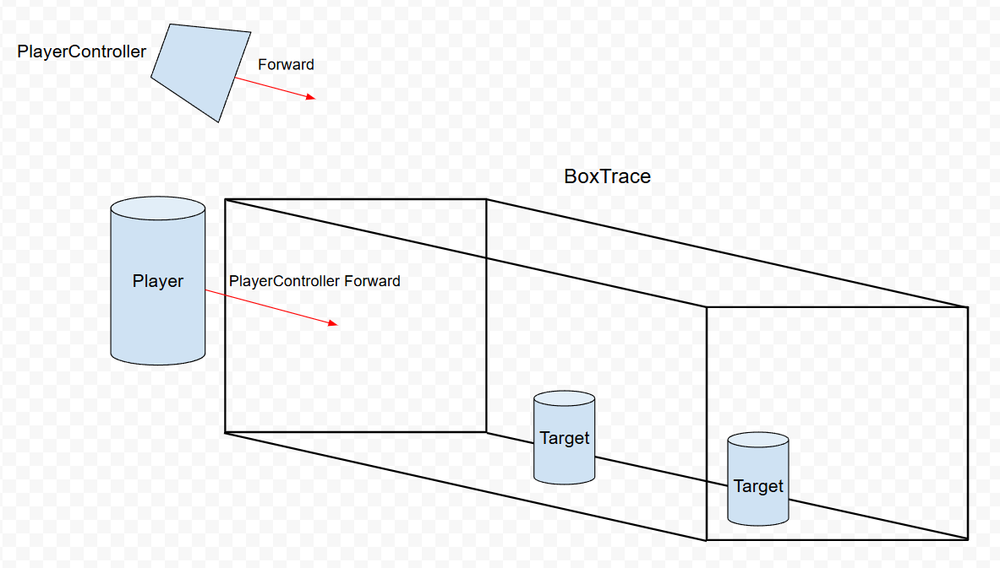
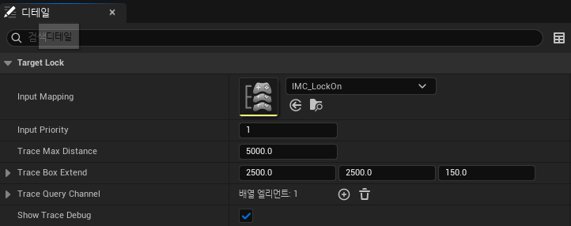

# Lock-on

## 개요
캐릭터가 특정 대상에 시점을 고정합니다.
- [실행 영상](https://drive.google.com/file/d/12piADb7b999jb2g5KII4wzZoPdcdZu4V/view?usp=sharing)

## 구현 내용
### 대상 찾기
- Lock-on 어빌리티를 실행하면 플레이어 캐릭터의 위치를 기준으로, 플레이어 컨트롤러의 방향을 향해 박스 트레이스를 수행하여 시점을 고정할 대상을 찾습니다. ([FindAvailableActorsToLock](../../DungeonRealms/AbilitySystem/Abilities/DungeonRealmsGameplayAbility_LockOn.cpp#L165-L205))

### 시점 고정
- Lock-on 어빌리티에서 찾은 대상은 `TargetLockComponent`에 등록합니다. 그러면 매 프레임마다 `TargetLockComponent`에서 캐릭터가 대상을 바라보도록 회전을 합니다. ([TargetLockComponent](../../DungeonRealms/CombatSystem/DungeonRealmsTargetLockComponent.cpp#L23-L54))

### 대상 변경
- 시점이 고정된 상태에서 마우스 입력을 통해 대상을 변경합니다. ([HandleTargetSwitching](../../DungeonRealms/CombatSystem/DungeonRealmsTargetLockComponent.cpp#L125-L153))

## 문제 및 해결
### 시점 고정 중에 구르기
캐릭터가 시점을 대상에 고정 중인 상태에서 구르기를 실행하면 입력한 방향으로 회전하지 못합니다. 따라서 이때는 시점을 고정 중이더라도 잠시 고정을 풀고, 구르기를 완료하면 다시 시점을 대상에 고정합니다. 이를 구현하기 위해서 구르기 어빌리티가 실행 중에는 `State.Rolling` 태그를 소유하고 있고, 이를 검사해서 해당 태그를 소유 중이면 캐릭터의 회전을 갱신하지 않고 미룹니다. ([구현 코드](../../DungeonRealms/CombatSystem/DungeonRealmsTargetLockComponent.cpp#L44-L48)) 구르기가 끝나면 다시 시점을 대상에 고정합니다. ([UpdateOwnerRotation](../../DungeonRealms/CombatSystem/DungeonRealmsTargetLockComponent.cpp#L105-L126))
