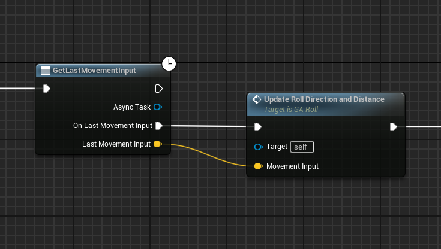
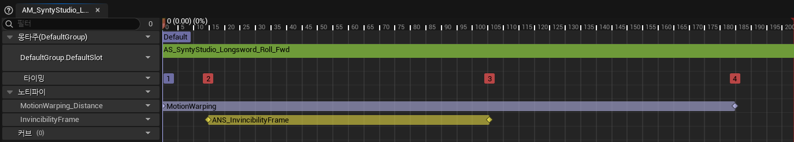

# Rolling

## 개요
공격을 회피합니다.
- [실행 영상 - 1](https://drive.google.com/file/d/1q-QrTzJ56xNbvF_gE0FxLWn2olSkVxiK/view?usp=drive_link)
- [실행 영상 - 2](https://drive.google.com/file/d/1IusOiazsN5omY9Ex8Gk4Kuh3d47BR39n/view?usp=drive_link)

## 구현 내용
### 이동 방향 동기화
- 클라이언트에서 어빌리티가 시작되기 때문에, 서버에서는 클라이언트로부터 회피 방향을 전달받아야 합니다. 이것을 AbilityTask로 구현하였습니다. ([UAbilityTask_GetLastMovementInput](../../DungeonRealms/AbilitySystem/Abilities/Tasks/AbilityTask_GetLastMovementInput.h))
    

### 무적 판정
- 애님 노티파이 스테이트를 사용하여 회피 애니메이션이 재생되는 동안 일정 구간에 `Effect.Invincible` 태그를 부여합니다.
    
- `CombatSystemComponent`에서 공격 판정을 수행할 때, 상대방이 `Effect.Invincible` 태그를 갖고 있다면 넘어갑니다. ([CombatSystemComponent_ProcessHitEvents](../../DungeonRealms/CombatSystem/DungeonRealmsCombatSystemComponent.cpp#L111-L114))

### 다양한 회피 거리 구현
- 모션 워핑을 통해 설정한 이동거리에 맞게 애니메이션을 재생합니다. 

## 문제 및 해결
### 이동 방향 동기화
클라이언트에서 회피 어빌리티를 실행할 때, 클라이언트 예측을 통해 어빌리티를 실행하도록 하기 위해서 서버에게 회피 방향을 동기화해야 했습니다. 그래야 서버에서 제대로 시뮬레이션을 진행할 수 있었습니다. 이것을 구현하는 방법으로 `AbilityTask`를 선택했습니다. 그 이유는 `AbilityTask`는 게임플레이 어빌리티와 통합되어서 동기화 함수를 처리하기 수월하기 때문입니다. 이 덕분에 회피 어빌리티에서 클라이언트, 서버를 구분하지않고 하나의 로직으로 구현할 수 있었습니다.