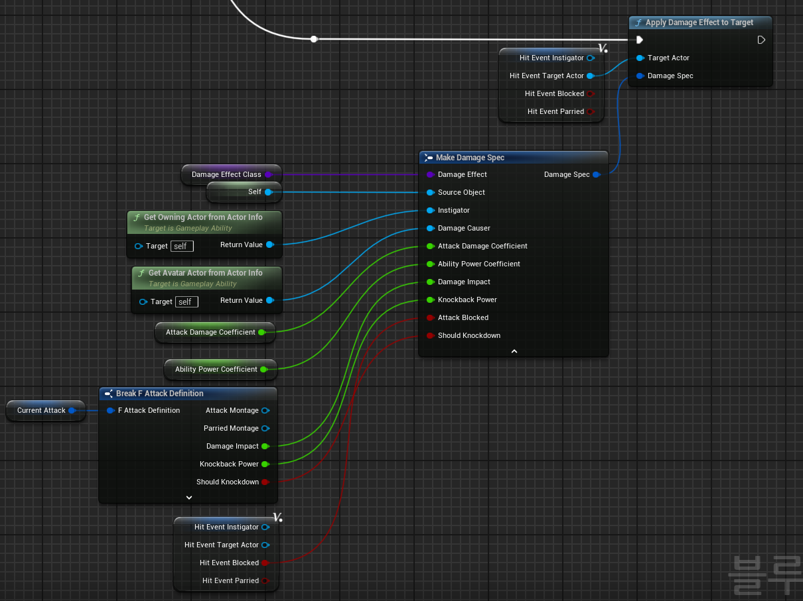
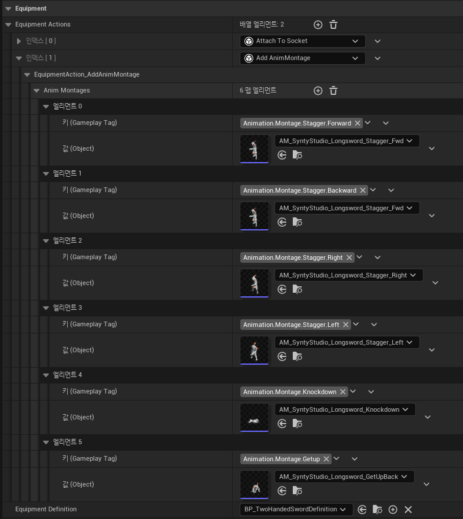

# Stagger & Knockdown System

## 개요
캐릭터가 공격을 받았을 때, 피격 상태(Stagger, Knockdown)를 결정하고 실행하는 시스템입니다.
- [Stagger](https://drive.google.com/file/d/1ZD0W-AKBgpQZz_a-0I8T1dAix2Bzf0Ll/view?usp=sharing)
- [Knockdown](https://drive.google.com/file/d/1kA4um4t7QU5RceGuX_DH6GYDVWm85Un9/view?usp=drive_link)

## 구현 내용
### Poise 속성
- Poise 속성을 정의하여 캐릭터가 현재 가지고 있는 균형 상태를 정의합니다. 이 속성은 체력과 같이 MaxPoise값으로 설정이 되고, 0이 되면 Knockdown이 됩니다.

### Stagger 어빌리티
- Stagger 어빌리티는 캐릭터가 피격을 당하면 발생하는 `Event.Damaged` 이벤트를 통해 실행됩니다. 피격을 당하는 과정에서 Poise가 감소하고([구현 코드](../../DungeonRealms/AbilitySystem/DungeonRealmsAttributeSet.cpp#L97-L101)), Stagger 어빌리티는 Poise 값을 검사하여 0보다 크면 Stagger 애니메이션 몽타주를 재생하고 0이 되면 `Event.Knockdown` 이벤트를 다시 발생시킵니다.

### GameplayEffectContext 확장
- 피격 당한 캐릭터가 stagger 또는 knockdown 어빌리티를 실행할 때, 상대방이 공격하는 힘에 따라 다양한 넉백 거리를 적용하고 싶었습니다. 이를 구현하기 위해서 GameplayEffectContext를 확장하여 데미지 효과를 적용할 때 관련 정보를 추가했습니다. ([GameplayEffectContext](../../DungeonRealms/AbilitySystem/DungeonRealmsGameplayEffectContext.h))

- 모션 워핑을 통해 다양한 넉백 거리에 따라 애니메이션을 자연스럽게 재생합니다.

### 피격 방향에 따른 애니메이션 재생
- Stagger의 경우에는 피격 방향에 따라 왼쪽, 오른쪽, 앞, 뒤로 피격을 당하는 애니메이션을 재생합니다. 피격 방향은 내적을 통해 앞, 뒤 방향을 검사하고, 외적을 통해 왼쪽, 오른쪽 방향을 검사합니다.

## 문제 및 해결
### 다양한 애니메이션 적용
Stagger & Knockdown의 경우 플레이어, 적 캐릭터 모두 사용하는 공용 어빌리티입니다. 따라서 어빌리티를 실행할 때, 어빌리티에서 사용할 애니메이션 몽타주를 설정해주어야 합니다. 처음에는 어빌리티를 상속하여 데이터를 설정하는 방식을 생각했습니다. 하지만 이렇게 할 경우, 무기가 추가될 때마다 해당 Stagger, Knockdown 애니메이션 몽타주를 설정한 어빌리티를 매번 생성해야해서 관리해야할 에셋이 너무 많아질꺼라 생각했습니다. 그래서 이 문제를 해결하기 위해 무기를 장착할 때, 필요한 애니메이션을 캐릭터에 등록하고, Stagger & Knockdown 어빌리티에서는 정의된 태그로 캐릭터에서 해당 애니메이션 몽타주를 가져와 재생하는 방식으로 구현하였습니다.
